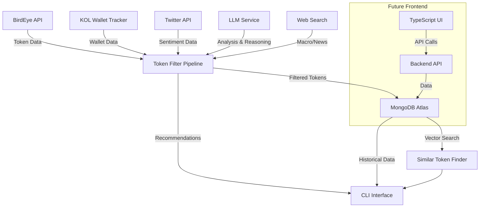
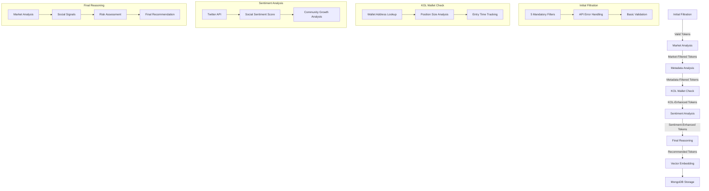

# Cainam-Core Architecture & Implementation Plan

Based on extensive analysis of the codebase, this document outlines a comprehensive architecture and implementation plan for enhancing Cainam-Core with the requested features, with a focus on CLI improvements before moving to the future frontend.

## 1. System Architecture



## 2. Enhanced Token Filtering Pipeline



## 3. Component-Level Architecture

### 3.1 Core Components to Enhance

1. **Token Filter Service**
   - Add stricter filtering with hardcoded 5 mandatory filters
   - Improve error handling and edge cases
   - Enhance debugging and logging capabilities
   - Integrate new Claude 3.7/O3-mini model support

2. **Wallet Tracker Service**
   - Complete implementation of `check_kol_ownership()`
   - Add real Solana blockchain API integration
   - Implement position size and entry time tracking
   - Provide detailed KOL ownership insights

3. **Twitter Integration**
   - Implement robust Twitter API client with cookie-based auth
   - Add sentiment analysis pipeline
   - Track community growth metrics
   - Add error handling for rate limits

4. **Prompt Engineering**
   - Review and optimize existing prompts
   - Add detailed reasoning prompts
   - Implement context limit management strategies
   - Ensure consistency across all prompts

5. **Autonomy Features**
   - Create `.clinerules` based on `.cursor/rules`
   - Set up MCP integrations for enhanced autonomous operation
   - Implement self-monitoring and error recovery

## 4. Implementation Plan

### Phase 1: Core Pipeline Hardening (1-2 days)

1. **Mandatory Filters Implementation**
   - Hardcode 5 mandatory filters in `token_filter.rs`
   - Ensure they appear in console logs at startup
   - Add validation to prevent bypassing these filters

2. **Error Handling & Edge Cases**
   - Add null checks throughout the pipeline
   - Implement robust error recovery
   - Add detailed logging for all edge cases

3. **Prompt Pipeline Review**
   - Audit current prompts in `src/prompts/`
   - Identify areas for improvement or context limit issues
   - Document token usage for each prompt

### Phase 2: KOL & Wallet Tracking Enhancement (1-2 days)

1. **Wallet Tracker Implementation**
   - Complete the placeholder function in `wallet_tracker/mod.rs`
   - Add Solana blockchain API integration
   - Implement cross-reference with KOL database

2. **KOL Database Management**
   - Enhance KOL wallet schema if needed
   - Add import/export functionality for wallet lists
   - Implement KOL influence scoring

3. **Position Analysis**
   - Track entry times and position sizes
   - Calculate significance of KOL investments
   - Generate insights based on KOL patterns

### Phase 3: Sentiment & Reasoning Enhancement (1-2 days)

1. **Twitter API Integration**
   - Implement robust Twitter client with cookie auth
   - Add rate limiting and retry logic
   - Gather social signals for token analysis

2. **Reasoning Output**
   - Enhance reasoning prompt templates
   - Implement detailed reasoning storage
   - Add visual presentation of reasoning in CLI

3. **Web Search Integration**
   - Add macro/news data gathering
   - Incorporate into token analysis
   - Provide context for market conditions

### Phase 4: Model & Performance Optimization (1 day)

1. **Model Integration**
   - Add Claude 3.7/O3-mini support
   - Optimize token usage
   - Implement fallback strategies

2. **Vector Search Enhancement**
   - Optimize vector embeddings
   - Implement similarity search features
   - Add recommendation based on historical patterns

3. **Performance Testing**
   - Benchmark the enhanced pipeline
   - Identify bottlenecks
   - Optimize critical paths

### Phase 5: Autonomous Operation & CLI Finalization (1 day)

1. **.clinerules Implementation**
   - Adapt `.cursor/rules` into `.clinerules`
   - Set up autonomous operation
   - Document self-healing capabilities

2. **MCP Integration**
   - Set up necessary MCP servers
   - Configure for the enhanced pipeline
   - Document API and usage

3. **CLI Enhancements**
   - Add color-coded output
   - Improve visual presentation
   - Add detailed debugging options

## 5. Detailed Tasks Breakdown

### 5.1 Token Filter Enhancements

```rust
// Add to token_filter.rs - Mandatory filter constants
const MANDATORY_FILTERS: &[(&str, &str, serde_json::Value)] = &[
    ("min_liquidity", "Minimum Liquidity", json!(10000)),
    ("min_market_cap", "Minimum Market Cap", json!(50000)),
    ("min_holder", "Minimum Holder Count", json!(100)),
    ("min_trade_24h_count", "Minimum 24h Trades", json!(50)),
    ("min_volume_24h_usd", "Minimum 24h Volume", json!(5000)),
];

// Modify get_birdeye_filters to enforce mandatory filters
pub async fn get_birdeye_filters(&self) -> Result<BirdeyeFilters> {
    // Log mandatory filters at startup
    info!("Applying mandatory filters:");
    for (key, desc, value) in MANDATORY_FILTERS {
        info!("  - {}: {}", desc, value);
    }
    
    // Existing LLM prompt logic...
    
    // Ensure mandatory filters are applied
    let mut filters = std::collections::HashMap::new();
    for (key, _, value) in MANDATORY_FILTERS {
        filters.insert(key.to_string(), value.clone());
    }
    
    // Add user filters, but don't overwrite mandatory ones
    // ...
}
```

### 5.2 Wallet Tracker Implementation

```rust
// Enhance check_kol_ownership in wallet_tracker/mod.rs
pub async fn check_kol_ownership(&self, token_address: &str) -> Result<Vec<KolOwnership>> {
    info!("Checking KOL ownership for token: {}", token_address);
    
    // Get active KOL wallets
    let wallets = self.get_active_kol_wallets().await?;
    
    // For each wallet, check token holdings via Solana API
    let mut ownership_data = Vec::new();
    for wallet in wallets {
        for address in &wallet.wallet_addresses {
            match self.check_wallet_token_balance(address, token_address).await {
                Ok(Some(balance)) => {
                    if balance > 0.0 {
                        ownership_data.push(KolOwnership {
                            kol_id: wallet.id.unwrap_or_default().to_hex(),
                            name: wallet.name.clone(),
                            wallet_address: address.clone(),
                            position_size: balance,
                            entry_time: Utc::now(), // In production, track first observed
                        });
                    }
                },
                Ok(None) => continue,
                Err(e) => {
                    error!("Error checking wallet {}: {}", address, e);
                    continue;
                }
            }
        }
    }
    
    info!("Found {} KOLs holding token {}", ownership_data.len(), token_address);
    Ok(ownership_data)
}

// New method to check wallet balance for a token
async fn check_wallet_token_balance(&self, wallet: &str, token: &str) -> Result<Option<f64>> {
    // Solana RPC call to get token accounts by owner
    // Parse response
    // Return balance or None
    // This would call a Solana API client that needs to be implemented
}
```

### 5.3 Reasoning Output Enhancement

```rust
// Enhanced reasoning prompt with more details
async fn generate_decision_reasoning(&self, token: &TokenAnalysis) -> Result<DecisionReasoning> {
    // Get token recommendation prompt template with more comprehensive fields
    let prompt_template = include_str!("../prompts/token_filter_reasoning_enhanced.txt");
    
    // Add more context to the prompt, such as:
    // - Market conditions
    // - Recent news (from web search)
    // - Technical indicators
    // - KOL ownership patterns
    
    // Get completion from LLM with higher token limit
    let response = self.get_completion_with_expanded_context(&prompt).await?;
    
    // Parse and return enhanced reasoning
    // ...
}
```

### 5.4 Autonomy Configuration

```
# .clinerules
# Adapted from .cursor/rules for autonomous operation

# Define autonomous agents
[agents]
wallet_tracker = "Monitors KOL wallets for token ownership"
sentiment_analyzer = "Analyzes Twitter and social sentiment"
token_filter = "Filters and recommends tokens"
reasoning_engine = "Provides comprehensive investment reasoning"

# Tool integrations
[tools]
cursor_tools = true  # Enable cursor-tools integration
web_search = true    # Enable web search for macro data
twitter_api = true   # Enable Twitter API for sentiment

# Autonomy settings
[autonomy]
self_healing = true          # Enable self-healing capabilities
error_recovery_attempts = 3  # Number of recovery attempts
logging_level = "detailed"   # Logging verbosity
```

### 5.5 MCP Integration

```typescript
// wallet-tracker-mcp.ts
import { Server } from '@modelcontextprotocol/sdk/server/index.js';
import { StdioServerTransport } from '@modelcontextprotocol/sdk/server/stdio.js';
import { CallToolRequestSchema, ListToolsRequestSchema } from '@modelcontextprotocol/sdk/types.js';

class WalletTrackerMcp {
  private server: Server;
  
  constructor() {
    this.server = new Server(
      {
        name: 'wallet-tracker-mcp',
        version: '0.1.0',
      },
      {
        capabilities: {
          tools: {},
        },
      }
    );
    
    this.setupToolHandlers();
  }
  
  private setupToolHandlers() {
    this.server.setRequestHandler(ListToolsRequestSchema, async () => ({
      tools: [
        {
          name: 'check_wallet_holdings',
          description: 'Check if a wallet holds a specific token',
          inputSchema: {
            type: 'object',
            properties: {
              wallet_address: {
                type: 'string',
                description: 'Solana wallet address',
              },
              token_address: {
                type: 'string',
                description: 'Token contract address',
              },
            },
            required: ['wallet_address', 'token_address'],
          },
        },
        // Add more tools as needed
      ],
    }));
    
    // Implement tool handlers
    // ...
  }
  
  async run() {
    const transport = new StdioServerTransport();
    await this.server.connect(transport);
    console.error('Wallet Tracker MCP running on stdio');
  }
}

// Start the server
const server = new WalletTrackerMcp();
server.run().catch(console.error);
```

## 6. Success Criteria & Validation

1. **Filter Quality**
   - 5 mandatory filters are consistently applied and visible in logs
   - Filtered tokens meet all criteria with no exceptions
   - Pipeline handles edge cases gracefully

2. **KOL Integration**
   - Successful tracking of KOL wallet holdings
   - Accurate reporting of position sizes and entry times
   - Insights derived from KOL ownership patterns

3. **Reasoning Quality**
   - Comprehensive reasoning output for all recommended tokens
   - Clear explanation of investment thesis
   - Detailed risk assessment and recommendations

4. **Performance**
   - Pipeline completes in reasonable time (< 5 minutes for typical batch)
   - No context limit issues or token overflows
   - Efficient resource usage

5. **Autonomy**
   - System runs without intervention
   - Self-recovers from common errors
   - Produces consistent, high-quality outputs

## 7. Frontend Preparation Strategy

While not implementing the frontend yet, we'll prepare the CLI to be easily extended:

1. **API Abstraction**
   - Create clear service interfaces that can be consumed by both CLI and future API
   - Implement consistent data models that can be serialized as JSON
   - Add pagination and filtering options that will be needed by UI

2. **Documentation**
   - Update database schema documentation for frontend reference
   - Document all service APIs and output formats
   - Prepare technical specifications for UI consumption

3. **Testing**
   - Create integration tests that validate pipeline output
   - Ensure all edge cases are handled gracefully
   - Verify data format consistency