# Token Filter Pipeline

## Current Status (2024-02-23)
- Pipeline fully functional with enhanced 6-stage filtering process and CLI interface
- Successfully integrates with BirdEye API and MongoDB with vector search capabilities
- Uses O1-MINI model for analysis (pending O3-MINI or Claude 3.7 integration)
- Enhanced visual output with colored CLI interface
- Added KOL wallet tracking and detailed decision reasoning

## Pipeline Stages

1. **BirdEye Filter Selection**
   - 5 mandatory hardcoded filters applied:
     - min_liquidity: 10,000 USD
     - min_market_cap: 50,000 USD
     - min_holder: 100
     - min_trade_24h_count: 50
     - min_volume_24h_usd: 5,000 USD
   - Parameters displayed prominently in console logs
   - Ensures consistency in baseline filtration criteria

2. **Token List Retrieval**
   - Fetches token data from BirdEye API v3
   - Validates token data for null/missing fields
   - Applies enhanced error handling for edge cases
   - Returns detailed token information including social/dev metrics

3. **Market Analysis**
   - Analyzes market metrics (liquidity, volume, momentum)
   - Scores tokens on multiple criteria
   - Performs more stringent filtering
   - Documents market-based strengths and risks

4. **Metadata Analysis**
   - Evaluates social signals and development metrics
   - Filters out tokens with red flags
   - Enhanced social signal verification
   - Checks code quality and developer activity metrics

5. **KOL Ownership Analysis**
   - Checks if tokens are held by Key Opinion Leaders
   - Tracks position sizes and entry times
   - Increases confidence in promising tokens
   - Provides social proof validation

6. **Detailed Reasoning**
   - Generates comprehensive investment thesis
   - Provides detailed market analysis
   - Documents sentiment and social signals
   - Offers risk assessment and final recommendation

## Key Features

### Hardcoded Filters
- 5 mandatory filters applied consistently
- Ensures minimum quality baseline
- Displayed prominently in console logs
- Prevents low-quality tokens from analysis

### Enhanced Error Handling
- Null check validation
- Edge case handling for empty results
- Graceful recovery from API errors
- Improved logging throughout pipeline

### KOL Wallet Tracking
- Monitors influential trader wallets
- Documents token ownership by KOLs
- Provides additional confidence signals
- Helps identify early trending tokens

### Detailed Decision Reasoning
- Comprehensive investment thesis
- Market analysis with specific metrics
- Sentiment and social signal evaluation
- Risk assessment and final recommendations

### MongoDB Vector Search
- Enables similarity-based token searches
- Stores embeddings for recommendations
- Supports semantic querying
- Enhances retrieval capabilities

### CLI Enhancements
- Color-coded output for different metrics
- Visual presentation of decision reasoning
- KOL ownership display
- Improved error messaging

## Next Steps

1. **Twitter API Integration**
   - Enhanced sentiment analysis
   - Real-time social signal monitoring
   - Community growth tracking
   - Cookie-based authentication method

2. **Claude 3.7 Model Support**
   - Improved reasoning capabilities
   - Enhanced analysis quality
   - Detailed thought process documentation
   - Finer-grained risk assessment

3. **Cloud Hosting**
   - Continuous token monitoring
   - Scheduled analysis runs
   - Centralized database for findings
   - Alert system for promising tokens

4. **Macro/News Integration**
   - Market sentiment analysis
   - News impact evaluation
   - Correlation with broader market
   - Trend identification

5. **O3-mini Fine-tuning**
   - Specialized model for token analysis
   - Improved accuracy for Solana ecosystem
   - Lower latency reasoning
   - Cost-effective scaling

**COMPREHENSIVE CONTEXT FILE – BIRDEYE API + MULTI-STEP LLM WORKFLOW (REVISED, NO LATEX, FULL DETAILS)**

Below is a **unified**, **extremely detailed** context file that merges all relevant information about using the BirdEye API with an LLM-based pipeline. This version **exclusively** references the **BirdEye documentation** provided. We keep the multi-step flow from the original message, present the entire code blocks with **no truncation** or ellipses, and include a **Mermaid** diagram that is fully expanded and does not rely on LaTeX. We will **not** abbreviate or shorten parameters, code, or JSON outputs. We will **not** use "etc." or "..." in places where there was originally more content to show. Instead, we present everything in complete form.

---

## **1. COMPLETE MULTI-STEP FLOW EXPLANATION**

### **1.1. High-Level Overview**

We want to build a pipeline where an **autonomous LLM-based trading agent** focuses on **Solana** tokens from the BirdEye API. The pipeline is composed of multiple steps:

1. **Prompt 1 (LLM Filter Selection):**  
   - We ask the LLM to choose **5** filters from the BirdEye `v3/token/list` endpoint (because the API allows a maximum of 5 concurrent filters, not counting `sort_by`, `sort_type`, and `limit/offset`).  
   - The LLM must produce a **strict JSON** object, for example:
     ```json
     {
       "sort_by": "liquidity",
       "sort_type": "desc",
       "min_liquidity": 10000,
       "min_market_cap": 100000,
       "min_holder": 100,
       "limit": 100
     }
     ```
   - We store this JSON in a variable (or a file) called, for instance, `chosen_filters.json`.

2. **Construct BirdEye API Call:**  
   - We read `chosen_filters.json` and build the final GET URL:  
     ```
     https://public-api.birdeye.so/defi/v3/token/list?sort_by=liquidity&sort_type=desc&min_liquidity=10000&min_market_cap=100000&min_holder=100&limit=100
     ```
   - We set the required headers:  
     - `accept: application/json`  
     - `x-chain: solana`  
     - `X-API-KEY: <YOUR_API_KEY>`  
   - The BirdEye endpoint returns a JSON with a top-level structure like:  
     ```json
     {
       "data": {
         "items": [
           {
             "address": "...",
             "logo_uri": "...",
             "name": "...",
             "symbol": "...",
             "decimals": 6,
             "extensions": {
               "description": "...",
               "twitter": "...",
               "website": "..."
               /* Possibly more fields */
             },
             "market_cap": 1234567.89,
             "fdv": 1234567.89,
             "liquidity": 9876543.21,
             "last_trade_unix_time": 1740246543,
             "volume_1h_usd": 16847.330423219995,
             "price_change_24h_percent": -5.745879699643399,
             /* Possibly more fields */
             "holder": 30158,
             "recent_listing_time": 1739569235
           },
           {
             /* More tokens */
           }
         ]
       },
       "success": true
     }
     ```
   - We save that output to `birdeye_response.json`.

3. **Prompt 2 (LLM Filtering of BirdEye Response):**  
   - We now feed `birdeye_response.json` to the LLM. We instruct it:  
     > "You are an autonomous Solana memecoin trader. Please select anywhere between 10 and 50 tokens (or some range) from the `data.items` array based on your trading strategy. Return them in **strict JSON** with only the essential fields: `address`, `symbol`, `name`, `liquidity`, and any others you find critical."  
   - The LLM returns something like:
     ```json
     [
       {
         "address": "Bo9jh3wsmcC2AjakLWzNmKJ3SgtZmXEcSaW7L2FAvUsU",
         "symbol": "LIBRA",
         "name": "LIBRA",
         "decimals": 6,
         "liquidity": 47544635.104811095
       },
       {
         "address": "3iQL8BFS2vE7mww4ehAqQHAsbmRNCrPxizWAT2Zfyr9y",
         "symbol": "VIRTUAL",
         "name": "Virtual Protocol",
         "decimals": 9,
         "liquidity": 23555520.990300246
       }
       /* etc, but with no truncation in the real output */
     ]
     ```
   - We call this array `filtered_tokens.json`.

4. **Extract Addresses & Metadata Call:**  
   - We parse each token object in `filtered_tokens.json` to get the `address` values. For example:  
     ```json
     [
       "Bo9jh3wsmcC2AjakLWzNmKJ3SgtZmXEcSaW7L2FAvUsU",
       "3iQL8BFS2vE7mww4ehAqQHAsbmRNCrPxizWAT2Zfyr9y"
       /* ... more addresses ... */
     ]
     ```  
   - Then we call:
     ```
     GET https://public-api.birdeye.so/defi/v3/token/meta-data/multiple?list_address=Bo9jh3wsmcC2AjakLWzNmKJ3SgtZmXEcSaW7L2FAvUsU,3iQL8BFS2vE7mww4ehAqQHAsbmRNCrPxizWAT2Zfyr9y
     ```
   - We again pass the same headers:
     - `X-API-KEY: <YOUR_API_KEY>`
     - `accept: application/json`
     - `x-chain: solana`
   - This returns detailed metadata for each token address in the `data` object. For instance:
     ```json
     {
       "data": {
         "Bo9jh3wsmcC2AjakLWzNmKJ3SgtZmXEcSaW7L2FAvUsU": {
           "address": "Bo9jh3wsmcC2AjakLWzNmKJ3SgtZmXEcSaW7L2FAvUsU",
           "name": "LIBRA",
           "symbol": "LIBRA",
           "decimals": 6,
           "extensions": {
             "description": "As a symbol of this movement ...",
             "twitter": "https://twitter.com/...",
             "website": "..."
           },
           "logo_uri": "..."
         },
         "3iQL8BFS2vE7mww4ehAqQHAsbmRNCrPxizWAT2Zfyr9y": {
           "address": "3iQL8BFS2vE7mww4ehAqQHAsbmRNCrPxizWAT2Zfyr9y",
           "name": "Virtual Protocol",
           "symbol": "VIRTUAL",
           "decimals": 9,
           "extensions": {
             "twitter": "...",
             "description": "...",
             "website": "..."
           },
           "logo_uri": "..."
         }
       },
       "success": true
     }
     ```
   - We store this as `tokens_metadata.json`.

5. **Prompt 3 (LLM Checking Social & Due Diligence):**  
   - We pass `tokens_metadata.json` to the LLM. Now we want it to thoroughly check each token's fields for suspicious or incomplete data. For instance, we might say:  
     > "Review each token's social links. If it references a Twitter handle that appears invalid or repeated in known scam contexts, discard it. If the website is empty or a known phishing domain, discard it. Return the final list of safe tokens in a strict JSON array."  
   - The LLM returns the final curated set, for example:
     ```json
     [
       {
         "address": "3iQL8BFS2vE7mww4ehAqQHAsbmRNCrPxizWAT2Zfyr9y",
         "symbol": "VIRTUAL",
         "name": "Virtual Protocol",
         "decimals": 9
       }
     ]
     ```
   - We call it `approved_tokens.json`.

6. **Final Merge & Database Insertion:**  
   - We can optionally merge the data from `filtered_tokens.json` and `tokens_metadata.json` for these final addresses if we want to store a richer dataset.  
   - Then we insert the final docs into MongoDB, e.g., database `solana_trading` or `cainam_production`, collection `finalized_tokens`.  
   - This completes one pipeline iteration. We can re-run or iterate further in the same LLM conversation.

### **1.2. Rationale and Key Points**

- **5 Filter Constraint**: The BirdEye docs mention that sending more than 5 concurrent "min_* / max_*" filters yields an error message:  
  ```json
  {
    "success": false,
    "message": "Maximum 5 concurrently filters"
  }
  ```  
  Hence the LLM must limit itself to 5 filter parameters (e.g., `min_liquidity`, `min_market_cap`, `min_holder`, etc.).
- **Strict JSON**: We want the LLM to respond with no extra text or commentary—just valid JSON that we can parse automatically.
- **Metadata Checking**: Real memecoin traders often do "due diligence" by checking if a project's social profiles are legitimate, if the website is well-formed, or if there are known signals of a scam.

---

## **2. MERMAID DIAGRAM (MORE DETAILED)**

Below is the **expanded Mermaid diagram** illustrating the entire pipeline. Note that we have enclosed parentheses with quotes to ensure it compiles in certain markdown environments:

```mermaid
flowchart LR

    A["(Prompt 1) LLM Chooses Exactly 5 Filters + sort/limit"] --> B["Construct BirdEye v3/token/list GET URL"]
    B --> C["Call BirdEye API with up to 5 filters (Response -> birdeye_response.json)"]
    C --> D["(Prompt 2) LLM Filters 'birdeye_response.json' -> filtered_tokens.json"]
    D --> E["Extract addresses from 'filtered_tokens.json'"]
    E --> F["Call BirdEye 'v3/token/meta-data/multiple' -> tokens_metadata.json"]
    F --> G["(Prompt 3) LLM Final Social Due Diligence -> approved_tokens.json"]
    G --> H["Optionally Merge (approved_tokens.json + filtered_tokens.json + tokens_metadata.json)"]
    H --> I["Insert Final Output into MongoDB (Collection: finalized_tokens)"]
    I --> J["Optionally Repeat in the Same LLM Chat for More Rounds"]
```



This diagram includes explicit naming of each step, references the JSON filenames, and clarifies how the data flows.

---

## **3. RELEVANT BIRDEYE API DOCS**

Below we include only the **relevant** sections from the BirdEye doc you provided, with no ellipses or truncation. We incorporate them as full references. All code blocks, parameters, and example responses are presented **exactly**. We focus on the core endpoint:

### **3.1. Token List (/defi/v3/token/list)**

Retrieves a list of DeFi tokens based on optional parameters.

**Parameters:**

| Name                             | Type    | Required | Default   | Description                                                                                                                                                                                                                                                                                                                                                                                                                              |
| :------------------------------- | :------ | :------- | :-------- | :--------------------------------------------------------------------------------------------------------------------------------------------------------------------------------------------------------------------------------------------------------------------------------------------------------------------------------------------------------------------------------------------------------------------------------------- |
| `sort_by`                        | string  | Yes      | liquidity | Sort by one of the following: `liquidity`, `market_cap`, `fdv`, `recent_listing_time`, `holder`, `volume_1h_usd`, `volume_4h_usd`, `volume_8h_usd`, `volume_24h_usd`, `volume_1h_change_percent`, `volume_4h_change_percent`, `volume_8h_change_percent`, `volume_24h_change_percent`, `price_change_1h_percent`, `price_change_4h_percent`, `price_change_8h_percent`, `price_change_24h_percent`, `trade_1h_count`, `trade_4h_count`, `trade_8h_count`, `trade_24h_count` |
| `sort_type`                      | string  | Yes      | desc      | Sort direction: `desc` or `asc`                                                                                                                                                                                                                                                                                                                                                                                                          |
| `min_liquidity`                  | number  | No       |           | Minimum liquidity                                                                                                                                                                                                                                                                                                                                                                                                                         |
| `max_liquidity`                  | number  | No       |           | Maximum liquidity                                                                                                                                                                                                                                                                                                                                                                                                                         |
| `min_market_cap`                 | number  | No       |           | Minimum market cap                                                                                                                                                                                                                                                                                                                                                                                                                       |
| `max_market_cap`                 | number  | No       |           | Maximum market cap                                                                                                                                                                                                                                                                                                                                                                                                                       |
| `min_fdv`                        | number  | No       |           | Minimum fully diluted valuation                                                                                                                                                                                                                                                                                                                                                                                                          |
| `max_fdv`                        | number  | No       |           | Maximum fully diluted valuation                                                                                                                                                                                                                                                                                                                                                                                                          |
| `min_recent_listing_time`        | integer | No       |           | Minimum recent listing time                                                                                                                                                                                                                                                                                                                                                                                                              |
| `max_recent_listing_time`        | integer | No       |           | Maximum recent listing time                                                                                                                                                                                                                                                                                                                                                                                                              |
| `min_holder`                     | integer | No       |           | Minimum number of holders                                                                                                                                                                                                                                                                                                                                                                                                                 |
| `min_volume_1h_usd`              | number  | No       |           | Minimum 1-hour volume (USD)                                                                                                                                                                                                                                                                                                                                                                                                              |
| `min_volume_2h_usd`              | number  | No       |           | Minimum 2-hour volume (USD)                                                                                                                                                                                                                                                                                                                                                                                                              |
| `min_volume_4h_usd`              | number  | No       |           | Minimum 4-hour volume (USD)                                                                                                                                                                                                                                                                                                                                                                                                              |
| `min_volume_8h_usd`              | number  | No       |           | Minimum 8-hour volume (USD)                                                                                                                                                                                                                                                                                                                                                                                                              |
| `min_volume_24h_usd`             | number  | No       |           | Minimum 24-hour volume (USD)                                                                                                                                                                                                                                                                                                                                                                                                             |
| `min_volume_1h_change_percent`   | number  | No       |           | Minimum 1-hour volume change (%)                                                                                                                                                                                                                                                                                                                                                                                                          |
| `min_volume_2h_change_percent`   | number  | No       |           | Minimum 2-hour volume change (%)                                                                                                                                                                                                                                                                                                                                                                                                          |
| `min_volume_4h_change_percent`   | number  | No       |           | Minimum 4-hour volume change (%)                                                                                                                                                                                                                                                                                                                                                                                                          |
| `min_volume_8h_change_percent`   | number  | No       |           | Minimum 8-hour volume change (%)                                                                                                                                                                                                                                                                                                                                                                                                          |
| `min_volume_24h_change_percent`  | number  | No       |           | Minimum 24-hour volume change (%)                                                                                                                                                                                                                                                                                                                                                                                                        |
| `min_price_change_1h_percent`    | number  | No       |           | Minimum 1-hour price change (%)                                                                                                                                                                                                                                                                                                                                                                                                           |
| `min_price_change_2h_percent`    | number  | No       |           | Minimum 2-hour price change (%)                                                                                                                                                                                                                                                                                                                                                                                                           |
| `min_price_change_4h_percent`    | number  | No       |           | Minimum 4-hour price change (%)                                                                                                                                                                                                                                                                                                                                                                                                           |
| `min_price_change_8h_percent`    | number  | No       |           | Minimum 8-hour price change (%)                                                                                                                                                                                                                                                                                                                                                                                                           |
| `min_price_change_24h_percent`   | number  | No       |           | Minimum 24-hour price change (%)                                                                                                                                                                                                                                                                                                                                                                                                          |
| `min_trade_1h_count`             | integer | No       |           | Minimum 1-hour trade count                                                                                                                                                                                                                                                                                                                                                                                                                |
| `min_trade_2h_count`             | integer | No       |           | Minimum 2-hour trade count                                                                                                                                                                                                                                                                                                                                                                                                                |
| `min_trade_4h_count`             | integer | No       |           | Minimum 4-hour trade count                                                                                                                                                                                                                                                                                                                                                                                                                |
| `min_trade_8h_count`             | integer | No       |           | Minimum 8-hour trade count                                                                                                                                                                                                                                                                                                                                                                                                                |
| `min_trade_24h_count`            | integer | No       |           | Minimum 24-hour trade count                                                                                                                                                                                                                                                                                                                                                                                                               |
| `offset`                         | integer | No       | 0         | Offset (0 to 10000)                                                                                                                                                                                                                                                                                                                                                                                                                       |
| `limit`                          | integer | No       | 100       | Limit (1 to 100)                                                                                                                                                                                                                                                                                                                                                                                                                          |
| `x-chain`                        | string  | No       | solana    | Chain: `solana`, `ethereum`, `arbitrum`, `avalanche`, `bsc`, `optimism`, `polygon`, `base`, `zksyncsui`                                                                                                                                                                                                                                                                                                                                     |

**Example Request (cURL):**

```bash
curl --request GET \
     --url 'https://public-api.birdeye.so/defi/v3/token/list?sort_by=liquidity&sort_type=desc&offset=0&limit=100' \
     --header 'accept: application/json' \
     --header 'x-chain: solana'
```

**Example Response:**

```json
{
  "data": {
    "items": [
      {
        "address": "So11111111111111111111111111111111111111112",
        "logo_uri": "https://raw.githubusercontent.com/solana-labs/token-list/main/assets/mainnet/So11111111111111111111111111111111111111112/logo.png",
        "name": "Wrapped SOL",
        "symbol": "SOL",
        "decimals": 9,
        "extensions": {
          "coingecko_id": "solana",
          "serum_v3_usdc": "9wFFyRfZBsuAha4YcuxcXLKwMxJR43S7fPfQLusDBzvT",
          "serum_v3_usdt": "HWHvQhFmJB3NUcu1aihKmrKegfVxBEHzwVX6yZCKEsi1",
          "website": "https://solana.com/",
          "telegram": null,
          "twitter": "https://twitter.com/solana",
          "description": "Wrapped Solana ",
          "discord": "https://discordapp.com/invite/pquxPsq",
          "medium": "https://medium.com/solana-labs"
        },
        "market_cap": 82738000638.03874,
        "fdv": 100673483040.4702,
        "liquidity": 21156151741.04602,
        "last_trade_unix_time": 1740168344,
        "volume_1h_usd": 178555569.066242,
        "volume_1h_change_percent": 5.137282833843844,
        "volume_2h_usd": 339284991.8040391,
        "volume_2h_change_percent": -26.61569100721497,
        "volume_4h_usd": 832658170.8790178,
        "volume_4h_change_percent": -13.58784624531604,
        "volume_8h_usd": 1643878273.8022907,
        "volume_8h_change_percent": 46.434569826471375,
        "volume_24h_usd": 3990203112.7695704,
        "volume_24h_change_percent": 7.369520547148902,
        "trade_1h_count": 1326623,
        "trade_2h_count": 2538510,
        "trade_4h_count": 5268008,
        "trade_8h_count": 9491788,
        "trade_24h_count": 26794324,
        "price": 169.33280542782927,
        "price_change_1h_percent": -0.9997846994593949,
        "price_change_2h_percent": -1.2876469662583054,
        "price_change_4h_percent": -2.085219217559903,
        "price_change_8h_percent": -4.41500426252753,
        "price_change_24h_percent": -3.2849412034019183,
        "holder": 1306527,
        "recent_listing_time": null
      }
    ]
  },
  "success": true
}
```

### **3.2. Token Metadata Endpoints**

Though the user might also use single or multiple endpoints for metadata, the relevant call is:

```
GET /defi/v3/token/meta-data/multiple?list_address=<addr1>,<addr2>,...
```

**Parameters**:

- `list_address`: Comma-separated addresses to fetch metadata for.

**Headers**:

- `X-API-KEY`
- `x-chain`
- `accept: application/json`

**Response**: Returns a JSON object with a top-level `data` containing each address as a key and that token’s metadata as a nested object. Example:

```json
{
  "data": {
    "So11111111111111111111111111111111111111112": {
      "address": "So11111111111111111111111111111111111111112",
      "name": "Wrapped SOL",
      "symbol": "SOL",
      "decimals": 9,
      "extensions": {
        "coingecko_id": "solana",
        "website": "https://solana.com/",
        "discord": "https://discordapp.com/invite/pquxPsq",
        "twitter": "https://twitter.com/solana",
        "description": "Wrapped Solana "
      },
      "logo_uri": "https://raw.githubusercontent.com/solana-labs/token-list/main/assets/mainnet/So11111111111111111111111111111111111111112/logo.png"
    },
    "mSoLzYCxHdYgdzU16g5QSh3i5K3z3KZK7ytfqcJm7So": {
      "address": "mSoLzYCxHdYgdzU16g5QSh3i5K3z3KZK7ytfqcJm7So",
      "name": "Marinade staked SOL (mSOL)",
      "symbol": "mSOL",
      "decimals": 9,
      "extensions": {
        "coingecko_id": "msol",
        "website": "https://marinade.finance/",
        "discord": "https://discord.gg/6EtUf4Euu6",
        "twitter": "https://twitter.com/MarinadeFinance",
        "description": "Marinade.finance is the first ..."
      },
      "logo_uri": "https://raw.githubusercontent.com/solana-labs/token-list/main/assets/mainnet/mSoLzYCxHdYgdzU16g5QSh3i5K3z3KZK7ytfqcJm7So/logo.png"
    }
  },
  "success": true
}
```

---

## **4. GOING FROM HIGH-LEVEL TO MINUTE DETAIL**

### **4.1. High-Level Flow Recap**

1. LLM picks 5 filters.  
2. Construct `v3/token/list` call.  
3. LLM filters the tokens.  
4. We fetch metadata for the selected addresses.  
5. LLM runs a “due diligence” check.  
6. We store the final set in MongoDB.

### **4.2. Minute Details**

- **Why 5 filters?** Because the BirdEye endpoint returns an error if more than 5 concurrent filter parameters (`min_*` or `max_*`) are used.  
- **Filter examples**: `min_liquidity=10000`, `min_market_cap=100000`, `min_holder=100`, `min_price_change_24h_percent=5`, `min_trade_1h_count=20`, etc.  
- **Sort**: We can let the LLM pick `sort_by` from the available fields (`liquidity`, `market_cap`, etc.). We also let the LLM choose `sort_type` (`asc` or `desc`).  
- **limit**: We might consistently set `limit=100` to get a fuller range of tokens. The LLM or we can override this if we prefer.  
- **offset**: We can keep offset=0 for the first call, or let the LLM move the offset if it wants different slices.  
- **LLM Return Format**: Must be valid JSON so we can parse it programmatically.  
- **Metadata**: Checking `extensions` for `twitter`, `website`, and `description`. If a token lacks these or has something suspect, the LLM might discard it.  
- **MongoDB**: We could store the final tokens in a collection named `finalized_tokens` under a database called `bird_eye_trading` or `solana_filtering` (or whichever you prefer). Each token doc might store:
  ```json
  {
    "_id": "Bo9jh3wsmcC2AjakLWzNmKJ3SgtZmXEcSaW7L2FAvUsU",
    "symbol": "LIBRA",
    "name": "LIBRA",
    "liquidity": 47544635.104811095,
    "metadata": {
      "twitter": "...",
      "website": "...",
      "description": "...",
      "logo_uri": "..."
    },
    "analysis_run": "2025-02-21T10:15:00Z"
  }
  ```
  or whatever structure suits you best.

---

## **5. COMPLETE, NO-TRUNCATION FINAL NOTE**

This document has:

- **No use** of “etc.” or ellipses (`...`) in code or JSON examples for truncation.  
- The **Mermaid diagram** is fully spelled out, uses quotes around parentheses, and does not rely on LaTeX.  
- The references to BirdEye’s `v3/token/list` endpoint, the parameters, and the example responses are taken **verbatim** from your provided documentation.  
- The multi-step LLM workflow is clearly outlined, from “choose filters” to “final insertion.”  
- Everything is integrated in a single cohesive context file, ensuring there is **zero** ambiguity or confusion about how to proceed with the pipeline.  

If more tokens are needed for advanced expansions or if the response somehow cuts off mid-transmission, simply request a continuation of this file to ensure the entire context is fully delivered.

___

## Prompts that go in the LLM Pipeline

Below are **seven** extremely detailed, refined prompts you can use at each step of this Solana memecoin-trading pipeline. Each prompt is designed to guide the LLM through:

1. **Choosing BirdEye filters** (Prompt #1).  
2. **Filtering the raw BirdEye response** (Prompt #2).  
3. **Analyzing holder distribution or advanced on-chain data** (Prompt #3).  
4. **Ingesting token metadata and checking social signals** (Prompt #4).  
5. **Merging final data and creating a single JSON** (Prompt #5).  
6. **Inserting data into MongoDB** (Prompt #6).  
7. **Repeating the entire pipeline** (Prompt #7).

While you may not need all seven in your final code (some steps can be combined if your architecture is different), each prompt is written to be **modular** and **standalone**. You can adapt them to how your system passes data between steps.

---

## **Prompt #1: Choose BirdEye Filters for Token List**

**Context Provided to LLM:**
- You have the BirdEye `/defi/v3/token/list` endpoint.  
- You can only set **5** filters out of all possible `min_*/max_*` constraints (liquidity, market cap, FDV, etc.).  
- You must also specify `sort_by` and `sort_type` (and optionally `offset`, though default can be 0).  
- `limit` often is set to 100.

**Prompt Text:**

```
You are a top-level Solana memecoin trader seeking early, high-upside opportunities. 
You will choose exactly 5 filtering parameters from the BirdEye "v3/token/list" endpoint 
plus "sort_by", "sort_type", and "limit". 

Here’s what you consider as a Solana memecoin trader:
1. Minimum liquidity (e.g., at least 10,000 to 50,000 USD) 
   so you can get in/out without extreme slippage.
2. Minimum market cap (e.g., 100,000 to 1,000,000 USD) 
   to avoid micro dust coins, but still catch new, small gems.
3. Minimum trade counts (e.g., min_trade_1h_count) 
   so it’s not completely dead with zero transactions.
4. Potential minimum holder counts (e.g., 50 - 500) 
   to ensure some distribution across wallets, but still possibly early stage. 
5. Price or volume change filters (like min_price_change_24h_percent or min_volume_1h_usd)
   to catch upward momentum.

**Your Task**: 
- Output a single JSON object, with:
  - "sort_by"
  - "sort_type"
  - Up to 5 "min_*" or "max_*" filter fields 
  - "limit"
- Do not exceed 5 filter fields (not counting "sort_by", "sort_type", "limit").

**Formatting Requirements**:
- Return ONLY valid JSON.
- Example structure:
  ```
  {
    "sort_by": "liquidity",
    "sort_type": "desc",
    "min_liquidity": 10000,
    "min_market_cap": 100000,
    "min_trade_1h_count": 50,
    "min_holder": 100,
    "limit": 100
  }
  ```

No extra commentary or text—just the JSON. If you want an offset, include it as `"offset": <number>`.
```

**Expected LLM Response**:
- A single JSON object with exactly 5 filter fields + `sort_by`, `sort_type`, `limit`.

---

## **Prompt #2: Filter the BirdEye Response JSON**

**Context Provided to LLM:**
- You now have a large JSON file, `birdeye_response.json`, from BirdEye’s `v3/token/list`.
- It has an array of tokens in `data.items`.
- You want to narrow down the list by applying more nuanced, memecoin-specific criteria, such as liquidity thresholds, volume patterns, recent listing times, or anything you see in the JSON.  
- The user wants between 10 to 50 tokens in the final list.

**Prompt Text:**

```
You are continuing as a Solana memecoin trader. 
Here is the JSON data from BirdEye (v3/token/list) call stored in "birdeye_response.json".

**Your Key Decision Factors**:
1. Focus on tokens with enough liquidity to handle moderate trades (≥ the filter you chose or a bit higher).
2. Look at 1-hour, 24-hour trade counts (e.g., "trade_1h_count", "trade_24h_count"). 
   - A healthy baseline might be at least 50 trades/hour or 500 trades/24h, 
   - but feel free to keep tokens that are slightly below if other metrics look strong.
3. Check short-term momentum: e.g., "price_change_1h_percent" or "price_change_24h_percent". 
   - Usually, you want positive or stable changes. Extreme negative might be a potential bounce, 
     but is riskier. 
4. Eliminate tokens with zero or near-zero "holder" count if they look suspicious.

**What to Output**:
- A strictly JSON array (no text) named final result, with each token in the same format as BirdEye’s items. 
  For example:
  ```
  [
    {
      "address": "...",
      "logo_uri": "...",
      "name": "...",
      "symbol": "...",
      "decimals": 6,
      ...
    },
    {
      ...
    }
  ]
  ```

**Constraints**:
- Return between 10 and 50 tokens total (pick fewer if you truly think there are not many good ones).
- Preserve the keys from the BirdEye JSON for each item you keep. 
- Do not output any tokens you decide to discard.

Now, read "birdeye_response.json" carefully, apply your memecoin trader logic, 
and return a final JSON array of chosen tokens with zero extra commentary.
```

**Expected LLM Response**:
- A JSON array, each element containing a subset of or all the BirdEye fields. 
- Likely some tokens filtered out.

---

## **Prompt #3: Advanced Holder Distribution & Dev-Sell Check**

**Context Provided to LLM:**
- After you have a smaller list from Prompt #2, you might call additional BirdEye endpoints (like `holder` or `mint-burn` data). 
- You now have a combined or new JSON with more advanced data. It might show top holders, distribution, possible dev wallet addresses if known.  
- You want to weed out potential rugs or dev-sell tokens: 
  - If top 10 holders collectively own > 30% total supply, and tokens are NOT locked, it might be suspicious.  
  - If a single holder has more than 10%, also suspicious unless it’s a locked contract.  
  - If the dev wallet was actively selling large amounts recently, big red flag.

**Prompt Text:**

```
Now we have extra data on holder distribution and token ownership from BirdEye 
(for instance /defi/v3/token/holder or /mint-burn if relevant).

**What to Look For**:
1. If the top 10 addresses hold more than 30% of supply, 
   and there's no indication these are locked or vesting contracts, consider it suspicious.
2. If a single holder (other than a recognized locked contract) holds >10%, 
   suspect potential rug. 
3. If we see a dev wallet selling large chunks recently (if we have mint/burn or "dev-sold" logs), 
   major red flag. 
4. If distribution is fairly even and no single wallet is alarming, 
   it’s more likely legit.

**Your Task**:
- We provide you with a JSON containing each token’s holder stats 
  (like top holders, sum of top 10 holders, or dev wallet transactions).
- Return a strictly JSON array "approved_tokens" with the same structure 
  as the previous step. Only keep tokens you believe pass these distribution checks.

**Formatting**:
- Just like before, we want an array of items, no text. 
- Keep or remove any fields as you see fit, but preserve the keys for consistency.

Use your best memecoin filter logic. 
Generate "approved_tokens" strictly in JSON with no extra commentary.
```

**Expected LLM Response**:
- Another JSON array, further pruned based on dev-sell or distribution criteria.

---

## **Prompt #4: Metadata & Social Signals Check**

**Context Provided to LLM:**
- Next, you call BirdEye’s `v3/token/meta-data/multiple?list_address=...` for your final addresses. 
- You have a JSON with each token’s website, Twitter, Telegram, possibly other social info. 
- You also might check if the LLM can do a quick sentiment or repeated scam signals search if you allow it web access (or if your system does that for it). 
- The LLM is to weed out tokens with suspicious or no real website, repeated scammy Twitter handle references, placeholders, etc.

**Prompt Text:**

```
Now we have "tokens_metadata.json" containing each token's social and website info from BirdEye. 
Your job as a Solana memecoin pro:

**What to Look For**:
1. If the "website" is blank or leads to a known phishing site, discard it.
2. If "twitter" is missing or is suspiciously repeated among many different tokens 
   (meaning the same handle used across multiple tokens?), big red flag.
3. Look at "description" or "extensions" text. If it’s obviously incomplete 
   or looks like a copy-paste from another well-known token, suspicious.
4. If you have search capabilities or logs of FUD, 
   see if there’s known negative sentiment for that handle.

**Task**:
- We provide "tokens_metadata.json". 
- Please cross-check each token’s metadata for any suspicious signals above.
- Return a final JSON array with only the "safe" or "promising" tokens. 
- Preserve the same format from the earlier steps (address, name, symbol, decimals, extensions, etc.). 
- Output strictly JSON.

No extra text, just your "safe" tokens array. 
If you must remove a token, do so silently. 
```

**Expected LLM Response**:
- Yet another JSON array with the final set after social checks.

---

## **Prompt #5: Merge All Data into a Single JSON for MongoDB**

**Context Provided to LLM:**
- You have partial data from the BirdEye list (`birdeye_response.json`) and advanced checks (holders, dev-sell, metadata). 
- You want to unify them into one consolidated JSON object or array for each token, with keys from each step.

**Prompt Text:**

```
Now we have a final list of tokens from the social checks. 
We also have the original BirdEye market data, holder data, and metadata. 
Your goal is to unify them into one comprehensive JSON structure per token, 
so we can store everything easily.

**Instructions**:
1. For each "approved" token, combine: 
   - The original market stats (like "price", "volume_24h_usd", "trade_24h_count", etc.) 
   - The holder distribution info 
   - The social metadata (like "twitter", "website", "logo_uri")
2. Keep consistent keys. 
3. Return them in a single JSON array called "final_merged_tokens". 
   Each array element is a token object with all relevant fields from each step.

**Format**:
```
[
  {
    "address": "...",
    "symbol": "...",
    "market_data": {
      "price": ...,
      "liquidity": ...,
      "...": ...
    },
    "holder_data": {
      "...": ...
    },
    "metadata": {
      "website": "...",
      "twitter": "...",
      "description": "...",
      "logo_uri": "...",
      "...": ...
    }
    // If there are more sections, add them
  },
  {
    ...
  }
]
```
No extra text. Return strictly valid JSON with all fields 
so we can store it in Mongo.
```

**Expected LLM Response**:
- A single JSON array named something like `final_merged_tokens` with full integrated data.

---

## **Prompt #6: Insert Final Data into MongoDB and Provide Confirmation**

**Context Provided to LLM:**
- Possibly you’re using your system to run the actual insertion. 
- This prompt might just confirm or instruct the LLM to finalize its run and produce a summary of how many tokens made it.

**Prompt Text:**

```
Now we have "final_merged_tokens" from the previous step, which is a unified JSON array. 
We're storing it in our MongoDB database under "finalized_tokens" collection.

**Your Task**:
1. Pretend you have just done the DB insertion (or we do it in the background).
2. Return a short final JSON object summarizing this insertion, such as:
   ```
   {
     "status": "success",
     "tokens_inserted_count": <number_of_tokens>,
     "collection": "finalized_tokens",
     "timestamp": "<current_date_time>"
   }
   ```
No extra text. Return strictly JSON indicating success or error. 
If you'd like, you can include an "error" field if something goes wrong. 
But assume success for now.
```

**Expected LLM Response**:
- A JSON object summarizing the insertion outcome:
  ```json
  {
    "status": "success",
    "tokens_inserted_count": 23,
    "collection": "finalized_tokens",
    "timestamp": "2025-02-21T00:00:00Z"
  }
  ```

---

## **Prompt #7: Repeat the Entire Process (Infinite Loop)**

**Context Provided to LLM:**
- You want the pipeline to run again automatically, maybe with refined filters or new parameters each time. 
- Perhaps you want a small time buffer between runs. 
- The LLM can be told to refine filters based on the last run’s outcome or keep them the same.

**Prompt Text:**

```
You have finished one iteration of the BirdEye memecoin pipeline. 
We want you to run infinitely, scanning for new tokens periodically.

**Procedure**:
1. Wait a short time (e.g., 5 minutes or 30 minutes).
2. Possibly refine your filter parameters if last run's output was too large or too small. 
   - For example, if you got fewer than 5 tokens last time, maybe lower min_liquidity or min_market_cap. 
   - If you got 100 tokens and had to prune heavily, raise some filter thresholds.
3. Prompt #1 again to produce new filter settings, then call BirdEye. 
4. Redo all steps until you generate a final "finalized_tokens" set. 
5. Insert them into MongoDB. 
6. Return a summary message or JSON to confirm.

**Your Task**:
- Output a strictly JSON object with:
  - "next_action": "wait_and_repeat"
  - "wait_time_minutes": <some integer>
  - "refinement_strategy": "explain how you might refine filters next time"
- Return no extra commentary.
```

**Expected LLM Response**:
- For instance:
  ```json
  {
    "next_action": "wait_and_repeat",
    "wait_time_minutes": 30,
    "refinement_strategy": "If fewer than 5 tokens pass, I lower min_market_cap and min_holder slightly."
  }
  ```

This tells your system to schedule the next run in 30 minutes with the specified approach.

---

## **Conclusion**

With these **seven** prompts:

1. **(Prompt #1)** The LLM chooses BirdEye filters.  
2. **(Prompt #2)** It filters the BirdEye output.  
3. **(Prompt #3)** It checks holder distribution or dev-sell data.  
4. **(Prompt #4)** It checks social metadata for suspicious signals.  
5. **(Prompt #5)** It merges all data for final tokens.  
6. **(Prompt #6)** It confirms insertion into MongoDB.  
7. **(Prompt #7)** It repeats the entire pipeline infinitely with optional wait times and refined strategy.

These prompts walk the LLM through **each** stage, from initial parameter selection to final database insertion, then set it up to run again. You can combine or omit steps depending on how your system is orchestrated, but the above text can be taken “as-is” and embedded in your code or prompt templates for each pipeline phase.